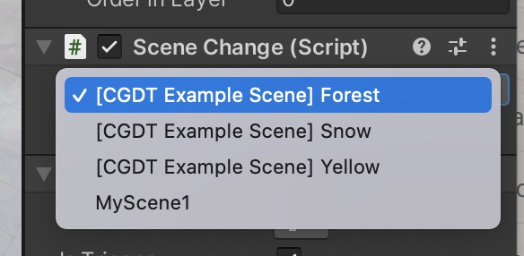

# Adding a Scene Change

Another cool feature of the toolkit is the scene change! Having a scene change in your project lets you link together and visit multiple scenes without needing to leave play mode.

* Scene change elements are objects that transport the player to another scene when the player passes through the object. Any object (drawing, painting, diagram, photo cut-out) can function as a scene change object.
* Here we will use the purple ring painting as a scene change object (because it looks vaguely like a portal -- but it is up to you what a scene change should look like)
* Here we scaled-down the ring painting and positioned in front of other objects to make it noticable.
* In the Projects tab, select the CGDT Components -> SceneChange folder
* Drag the SceneChange script to the purple ring in the scene
* Make sure you currectly added the script by checking that the scene change component shows up in the inspector (on the right) when the purple ring is selceted.

* Choose which scene you want your player to be transported to using the drop down menu (example scenes included in the toolkit are indicated with [CGDT Example Scene]. Here we've selected the example scene, Forest.
* Play your scene -- move the player through the purple ring and you will be transported to the Forest Scene.
* Make more new scenes, and add scene change objects that take the player from one scene to another!
